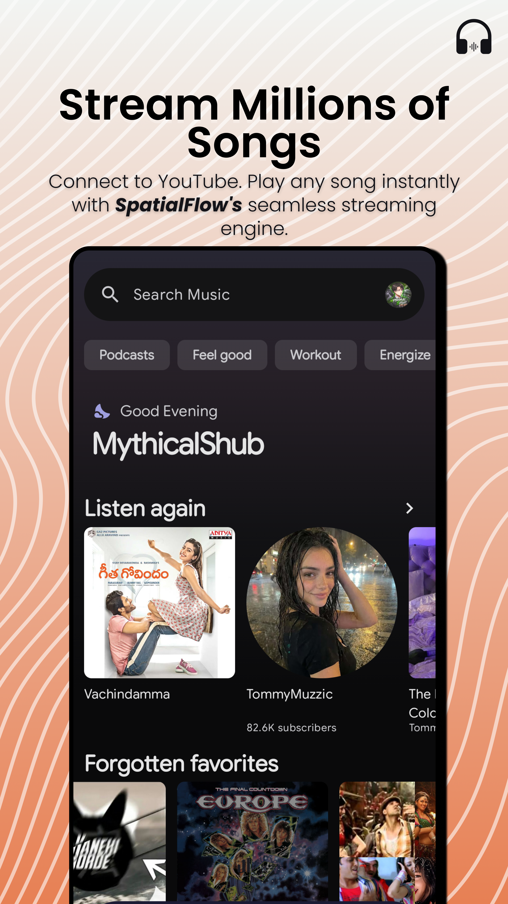
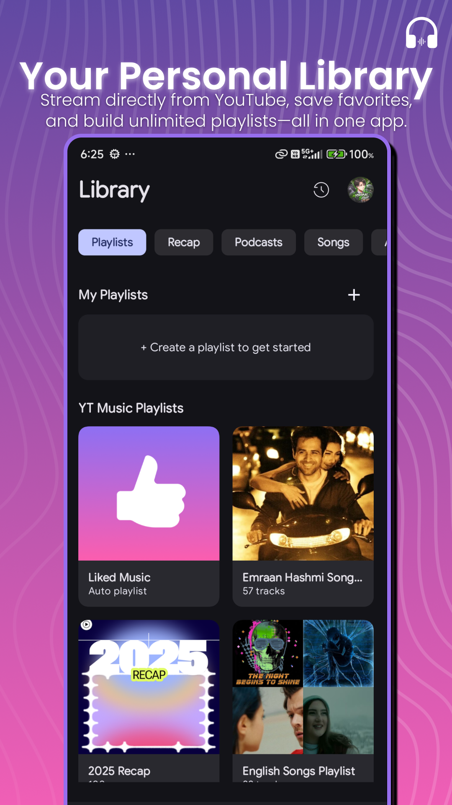
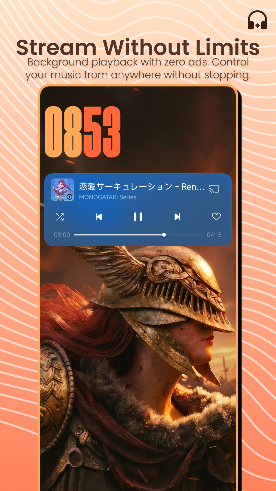
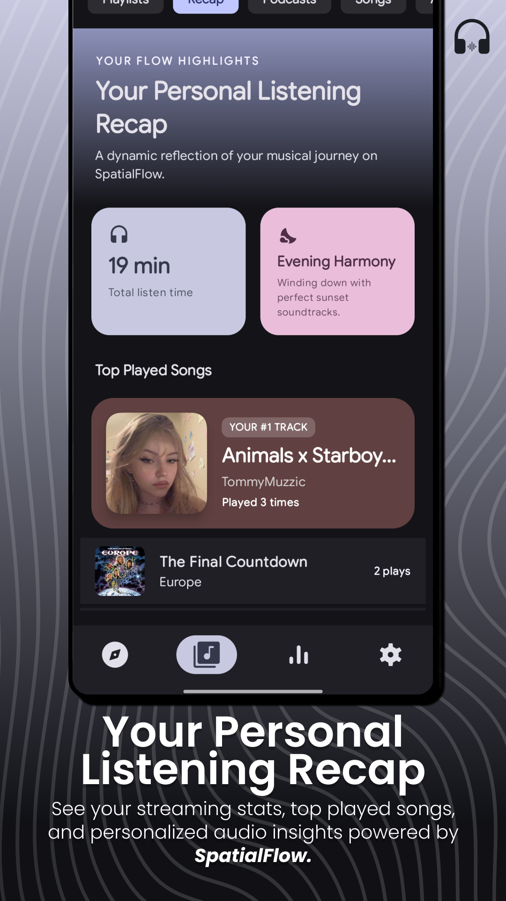
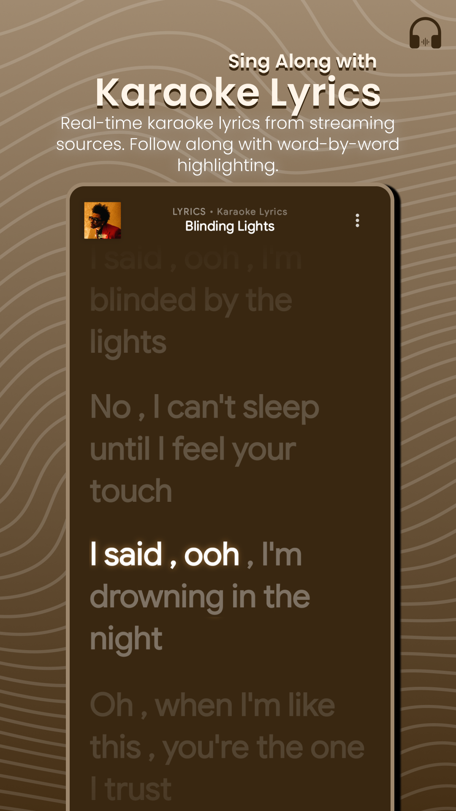
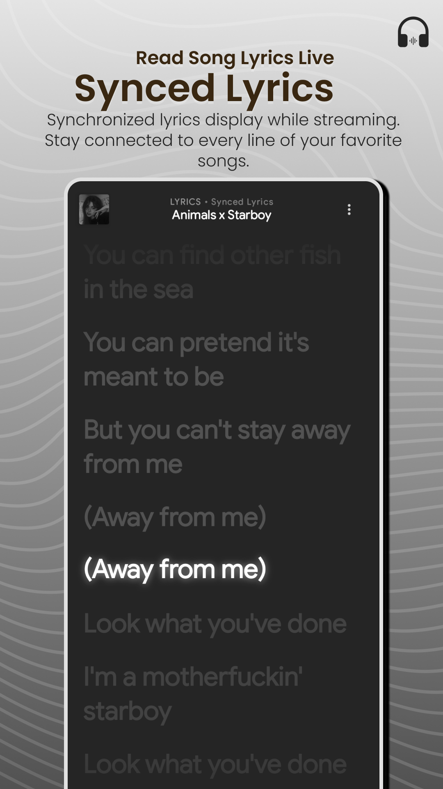
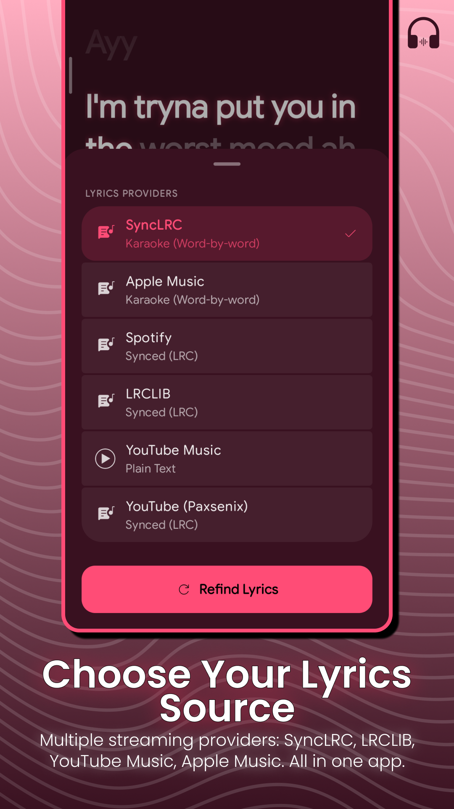

<p align="center">
  
</p>

<h1 align="center">TuneX Music</h1>

<p align="center">
  A modern, unified Android music player built with Jetpack Compose, Material Design 3 Expressive, and advanced audio processing for local libraries and online streaming.
</p>

<p align="center">
  <b>Hybrid Streaming | New Expressive UI | Material You | Dynamic Theming | Volume Normalization | Open Source</b>
</p>

<p align="center">
  <a href="#about-tunex-music"><b>About</b></a> •
  <a href="#features"><b>Features</b></a> •
  <a href="#screenshots"><b>Screenshots</b></a> •
  <a href="#tech-stack--architecture"><b>Architecture</b></a> •
  <a href="#installation"><b>Download</b></a> •
  <a href="#community--support"><b>Community & Support</b></a>
</p>

<p align="center">
  <a href="https://github.com/ahamed-2/TuneX-Music/releases"></a>
  <a href="https://github.com/ahamed-2/TuneX-Music/releases"></a>
  <a href="https://github.com/ahamed-2/TuneX-Music/actions"></a>
  <a href="https://github.com/ahamed-2/TuneX-Music/stargazers"></a>
  <a href="LICENSE"></a>
</p>

<p align="center">
  <a href="https://skillicons.dev">
    
  </a>
</p>

<p align="center">
  <a href="https://t.me/al_rahim2"></a>
  <a href="https://ko-fi.com/ahamedrahim"></a>
</p>

---

## About TuneX Music

**TuneX Music** is a next-generation Android audio experience designed to seamlessly unify local music collections and online streaming into a single, cohesive application. Built natively with Kotlin and Jetpack Compose, it features an adaptive user interface that dynamically extracts colors from album artwork in real time to generate custom Material Design 3 Expressive themes.

Whether playing high-fidelity offline files from internal storage or streaming directly from YouTube Music, TuneX Music delivers high-performance playback through AndroidX Media3 (ExoPlayer), integrated with studio-grade volume normalization, custom crossfading, multi-provider lyrics, and responsive system haptics.

---

## Features

### Hybrid Playback System
- **Local Storage Library:** High-speed storage scanner supporting MP3, FLAC, AAC, WAV, and standard Android audio formats.
- **Online Streaming:** Built-in InnerTube API (WebRemix) integration to search, browse, and stream audio directly from YouTube Music without requiring accounts.
- **Unified Queue Management:** Combine local audio files and online streams into a single playback queue.

### Advanced Audio Engineering
- **Real-Time Volume Normalization (LUFS):** On-the-fly gain analysis and calculation ensuring uniform loudness across offline and online tracks (Default target: -14 LUFS).
- **Custom Crossfade:** Smooth, configurable gapless transitions and overlapping fades between tracks.
- **Built-in Equalizer & Effects:** Multi-band equalizer with customizable presets, Bass Boost, Loudness Enhancer, and Environmental Reverb.

### Synchronized Lyrics & Player Canvas
- **Multi-Provider Lyrics Engine:** Automatic lyric fetching across multiple sources including YouLyPlus, LRCLIB, Paxsenix, and BetterLyrics.
- **Word-by-Word Karaoke:** High-precision TTML and LRC syllable sync rendering for line-by-line and word-by-word karaoke visualization.
- **Interactive Player Canvas:** Dynamic background visualizer and smooth canvas animations synced to audio playback.

### Premium Material Design 3 Expressive UI
- **Dynamic Color Engine:** Real-time color palette generation derived from active track artwork.
- **Modern UI Components:** Custom glassmorphism panels, spring-physics animations, fluid skeleton shimmers, and responsive layouts.
- **Appearance Customization:** Full support for pure dark (AMOLED) mode, custom accent themes, and dynamic navigation labels.

---

## Screenshots

<p align="center">
  
  
  
</p>
<p align="center">
  
  
  
</p>
<p align="center">
  
  
  
</p>
<p align="center">
  
  
  
</p>
<p align="center">
  
</p>

---

## Tech Stack & Architecture

| Layer | Technology |
| :--- | :--- |
| **Platform** |  |
| **Language** |  |
| **UI Toolkit** |   |
| **Architecture** |  Model-View-Intent Presentation Layer |
| **Media Engine** |  |
| **Dependency Injection** |  Hilt for Android |
| **Networking** |  Retrofit + OkHttp & Coroutines |
| **Data Extraction** |  InnerTube Models + NewPipe Extractor |
| **Build System** |   |

---

## Requirements

| Parameter | Minimum / Required |
| :--- | :--- |
| **Minimum SDK** | API 25 (Android 7.1 Nougat) |
| **Target SDK** | API 37 |
| **JDK Version** | Java Development Kit 17 |

---

## Installation

### Download Pre-Built APK
Download the latest APK release directly from GitHub:
[Download TuneX Music Releases](https://github.com/ahamed-2/TuneX-Music/releases)

### Build from Source Code
```bash
git clone https://github.com/ahamed-2/TuneX-Music.git
cd TuneX-Music
```
1. Open the project in Android Studio (Koala edition or newer recommended).
2. Allow Gradle sync to download dependencies and setup the workspace.
3. Select an active device or emulator and run the `app` target.

---

## In-App Auto Updater

TuneX Music includes an integrated update manager:
- Automatically checks GitHub Releases for new updates on launch.
- Provides one-tap direct APK download within the app.
- Seamless installation managed via Android Package Installer.

---

## Contributing

Contributions, bug reports, and feature requests are welcome:
1. Review open issues on the GitHub repository.
2. Fork the project repository and create a feature branch.
3. Submit a Pull Request detailing your changes.

---

## Community & Support

Join the official TuneX Music community or support ongoing development:
- **Telegram:** [t.me/al_rahim2](https://t.me/al_rahim2) — Support, discussions, and updates.
- **Support Development:** [](https://ko-fi.com/ahamedrahim) — Help keep the project open-source and active.

---

## Credits & Acknowledgements

TuneX Music is a rebranded derivative built upon the open-source **SpatialFlow** project by **Shubham Karande** ([github.com/MythicalSHUB/SpatialFlow](https://github.com/MythicalSHUB/SpatialFlow)) and other open-source software and community projects. The original project is licensed under the Apache License 2.0. TuneX Music modifications are maintained by Ahamed Rahim.

- **[SpatialFlow](https://github.com/MythicalSHUB/SpatialFlow):** Original project that TuneX Music is based on. Copyright © 2026 Shubham Karande.
- **[ArchiveTune](https://github.com/rukamori/ArchiveTune):** Foundation for the lyrics engine, player canvas, UI animations, and lyrics providers.
- **[InnerTune](https://github.com/z-huang/InnerTune):** Foundational architecture and core player model design.
- **[OuterTune](https://github.com/OuterTune/OuterTune):** Logic and structure for InnerTube API calls and streaming metadata retrieval.
- **[PixelPlayer](https://github.com/PixelPlayerHQ/PixelPlayer):** Design inspiration for the mini player layout and onboarding interface.
- **[Material Design 3](https://m3.material.io/):** Google's design system providing expressive UI components.

---

## Developer

**Ahamed Rahim**
- GitHub: [@ahamed-2](https://github.com/ahamed-2)
- Telegram: [@al_rahim2](https://t.me/al_rahim2)
- Instagram: [@ahamedrahim2.0](https://instagram.com/ahamedrahim2.0)
- Facebook: [TuneX Music](https://facebook.com/TuneXMusic)
- Ko-fi: [ko-fi.com/ahamedrahim](https://ko-fi.com/ahamedrahim)
- YouTube: [@JubairSensi](https://youtube.com/@JubairSensi)

Focused on building modern, fluid, and open-source Android applications.

---
## License
This project is licensed under the Apache License 2.0 License - see the [LICENSE](LICENSE) file for details.
---

## Keywords

TuneX Music, TuneX Music Android App, Jetpack Compose Music Player, Material Design 3 Expressive, Material You Audio Player, Dynamic Color Theming, YouTube Music Streaming App, InnerTube API Client, YouTube Music Player Android, AndroidX Media3 Player, ExoPlayer Android, Open Source Spotify Alternative, Open Source YouTube Music Alternative, InnerTune Alternative, OuterTune Alternative, ViMusic Alternative, ArchiveTune, PixelPlayer, Kotlin Music Player, LUFS Normalization, ReplayGain Android, Audio Gain Calculation, Real-time Volume Normalizer, Custom Audio Crossfade, Gapless Playback, 5-Band Audio Equalizer, Bass Boost Android, Environmental Reverb, Loudness Enhancer, Word-by-Word Karaoke Lyrics, Syllable Synced Lyrics, TTML Lyrics Parser, LRC Lyrics Parser, YouLyPlus Provider, LRCLIB Lyrics, Paxsenix Lyrics, BetterLyrics Provider, Multi-Provider Lyrics Engine, Animated Player Canvas, Audio Visualizer Canvas, AMOLED Pure Black Dark Mode, Glassmorphism UI Android, Spring Physics Animations, MVI Architecture Compose, Hilt Dependency Injection, Retrofit HTTP Client, Offline Music Scanner, FLAC Lossless Player, MP3 Audio Player, AAC Audio Player, Unified Playback Queue, In-App Auto Updater, Android 15 Audio App, Open Source Android Media Player.
